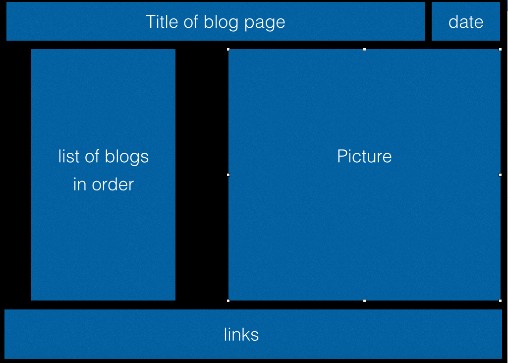

## 3. Wireframing Reflection
*Remember, reflections should only take about 10-15 minutes.*

Include images of your wireframe (inline, using markdown) below:

Blog Template Wireframe:

Index Wireframe:

***

- Did you enjoy wireframing your site?

Answer: I did enjoy it. I was able to use color which gave it more of a finished feel.

- Did you find yourself revising your wireframe often? Or did you stick with your first idea?

Answer: I had an idea in mind. I got lucky, I had Keynote installed in my computer and was able to bring it to life. I followed my instinct and stuck with my first idea.

- What questions did you ask during this challenge? What resources did you find to help you answer them?

Answer: What is my main goal? Who am I directing this to? What looks more appealing to me right now?

- What concepts are you having trouble with?

Answer: So far I feel I'm keeping up with this one.

- Did you learn any new skills or tricks?

Answer: I learned to use Keynote to create the wireframes. I read that other programs wanted access to your personal info. I didn't want to do that.

- How confident are you with each of the Learning Competencies for this challenge?

Answer: Very Confident.

- Which parts of the challenge did you enjoy?

Answer: I enjoyed making the frames, using markdown language to create a link and then seeing them on Github.

- Which parts of the challenge did you find tedious?

Answer: The initial reading on wireframing. It was informative but it was a bit long for our initial model.

