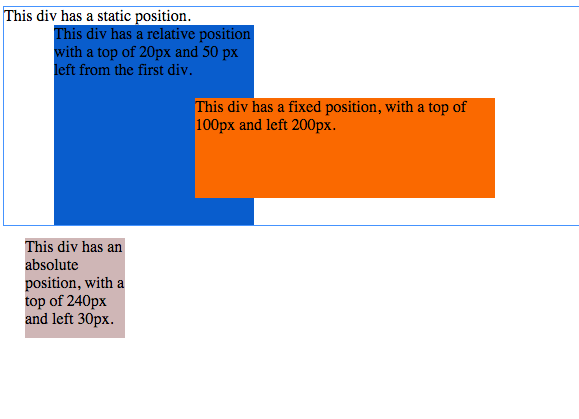
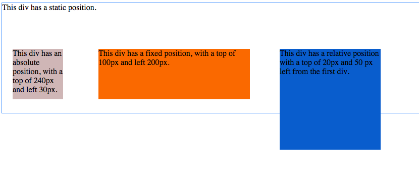
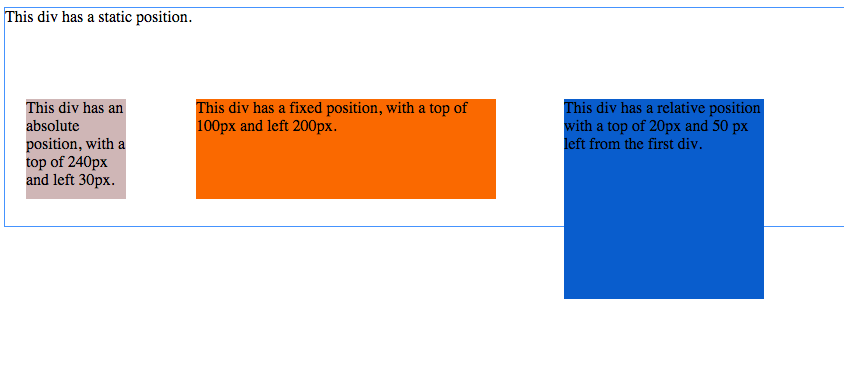
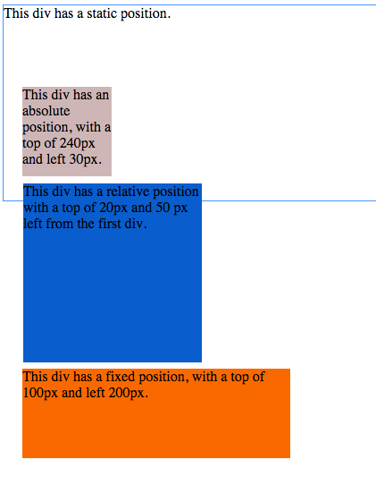
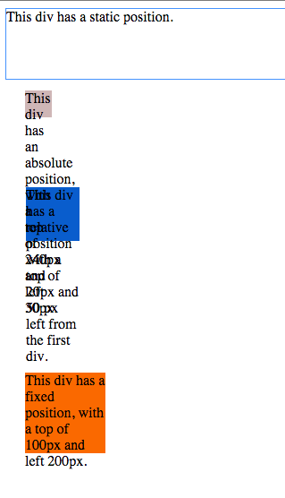
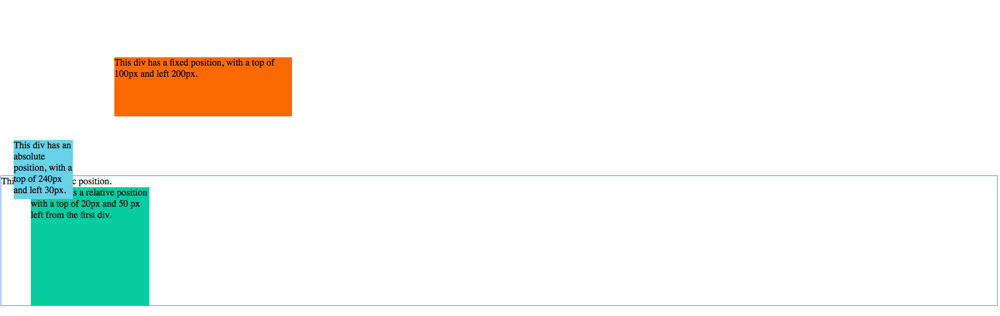
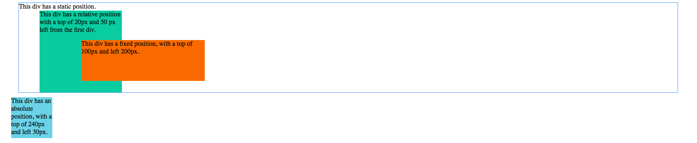

[Week 2 Home](../)

# U1.W2: Chrome DevTools

## Learning Competencies
- Navigate and edit a website's HTML and CSS elements using the Chrome DevTools inspector
- Explain what the DOM is and how it relates to CSS and HTML
- Use Chrome DevTools to manipulate elements in the DOM

## Summary
In this challenge, you'll be diving into Chrome DevTools. Inside the DevTools inspector window is an inner world of data that is communicated between the browser and server. These tools are invaluable for you as a developer and getting comfortable with them will help optimize your HTML and CSS editing, JavaScript debugging, and overall site performance. For the purposes of this challenge, we'll focus primarily on real-time HTML and CSS positioning in this challenge.

## Release 0: Research the DOM
Read/Watch both of the following resources to get some background on the DOM (Document Object Model) before diving into the challenge.
- [Skillcrush's introduction to the DOM](http://skillcrush.com/2012/10/17/dom-document-object-model/)
- [Introduction to the DOM (Video)](https://www.youtube.com/watch?v=-0ZcldkGlt8)

## Release 1: Chrome's DevTools
Use the following resources to acquaint yourself with Chrome's DevTools.
- [Don't Fear the Browser: Developer Tools & Vanilla Ice Cream](http://www.dontfeartheinternet.com/the-basics/dont-fear-the-browser)
- [Code School's DevTools course](http://discover-devtools.codeschool.com/):
  - Chapter 1: Getting Started & Basic DOM and Styles
  - Chapter 2: Advanced DOM and Styles

Take the quizzes at the end of each chapter, and take a screenshot of your Code School points when you complete them (the points appear on your report card, which you can navigate to by clicking the dropdown menu in the top right corner of the page). Add the image to your imgs directory in the `3-chrome-devtools` directory, and include the image inline in the [my_reflection.md](my_reflection.md) file.

## Release 2: Practice
First, find the tab that supports realtime editing of HTML and CSS. Then also find the quick key to open the Dev Tools inspector. It will certainly save you time.

Load the [css-positioning.html](css-positioning.html) in your browser and open the Dev Tools inspector, and play around with the boxes. How can you select and change them?

Then, complete each of the following. You will need to take a screenshot when you've completed each to include in your [my_reflection.md](my_reflection.md) file.

- Change the background-color of the boxes. To do this, in the css section type "background-color". You'll then see a list of colors - select your favorite for each box! I picked three random colors.

- Put the boxes in a row.

- Make the boxes have equal distance between them.

- Move all the boxes into one column.

- Resize the boxes so they are 30% of their original size.

- Move the static div to the bottom and give it an absolute position (no matter what, it should always be at the bottom of the page). Make the footer 100% the width of the screen.

- Make the absolute div a header at the top of the page with a fixed position so it's always at the top of the browser window. Make the width 95% of the entire screen and centered

- Move the relative div position to the right so it's like a right sidebar.

- Design your own configuration that uses margin, border, and padding. Explain the differences and how to use each to yourself.
- Make a configuration that uses block and inline-block to see what the differences are.

Upload each of your images into the week-2 [imgs](../imgs) directory and display them inline.

## Release 3: Reflect

Go to your [Reflection file](my_reflection.md) to write your reflection - include answers to the questions in the file in addition to the [reflection guidelines](https://github.com/Devbootcamp/phase-0-handbook/blob/master/coding-references/reflection-guidelines.md).

## Release 4: Commit and Push
Commit and push your changes to GitHub.
