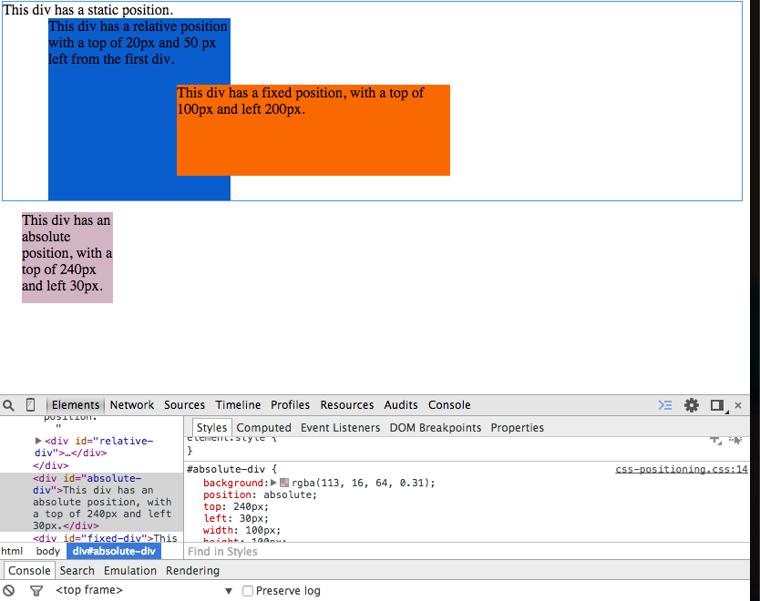
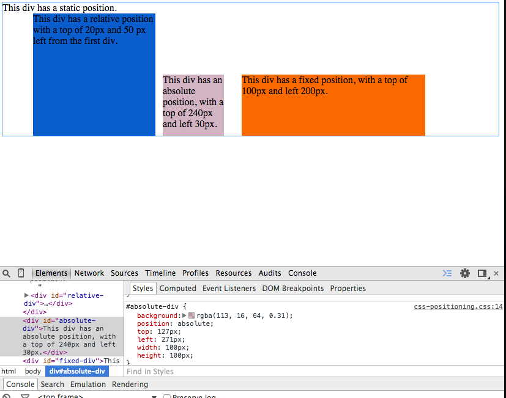
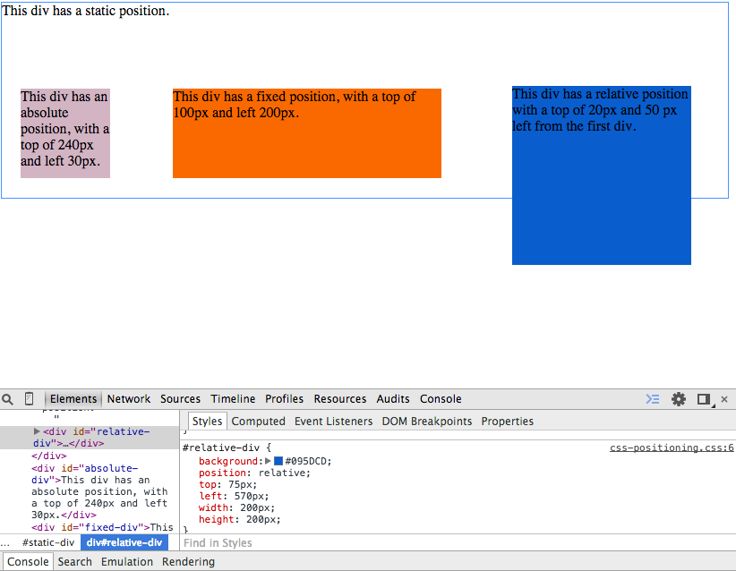
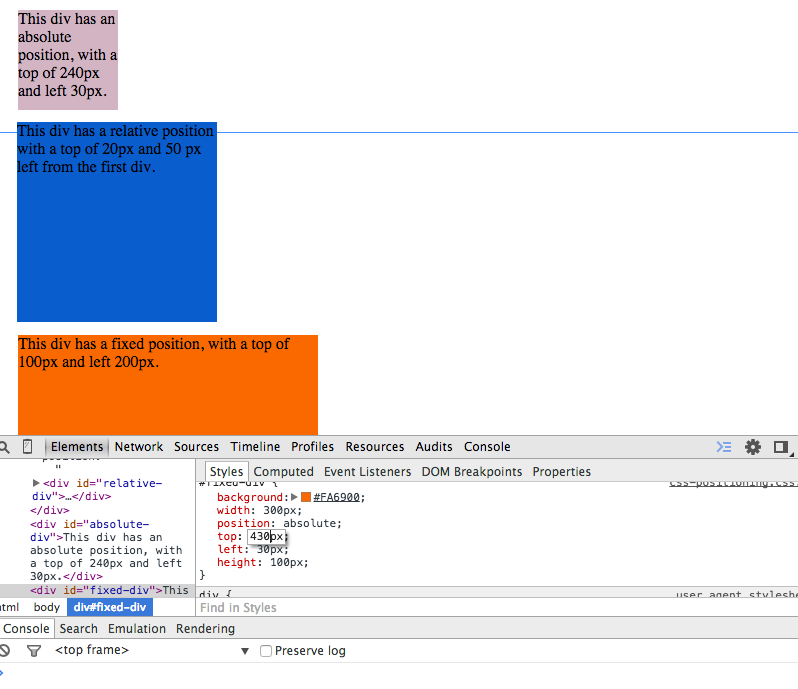
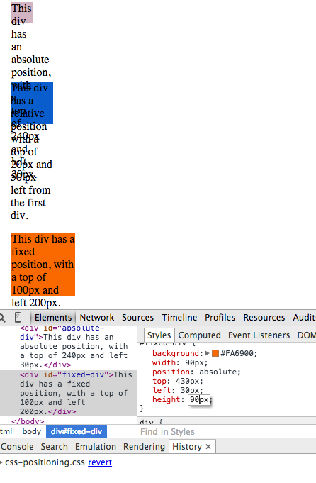
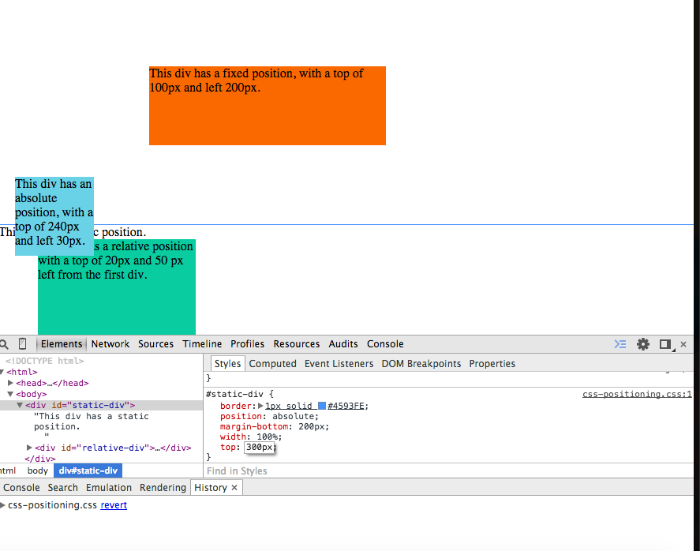
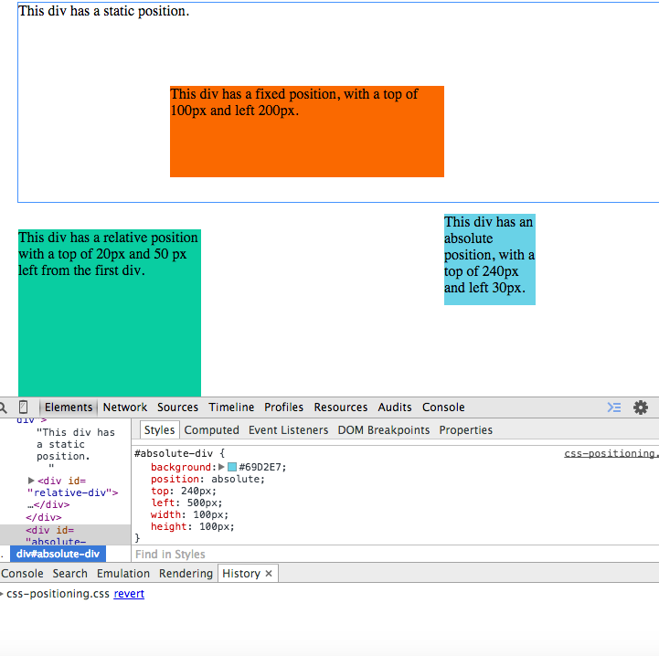
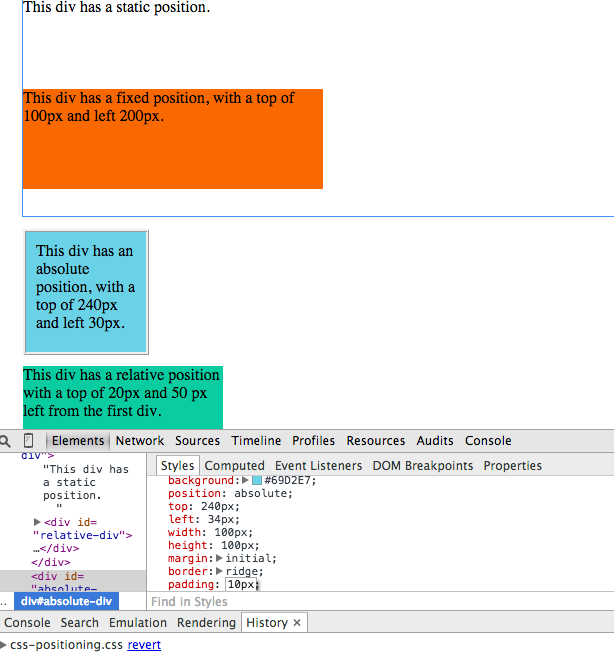
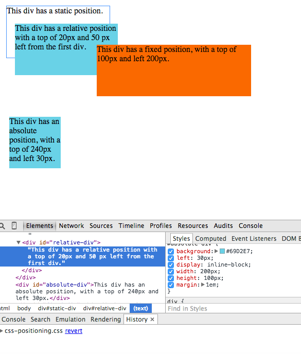

# 7. Chrome Dev Tools Challenge Reflection

## Release 2: Positioning

- New Colors:

- Boxes in a row

- Make the boxes have equal distance between them

- Move all the boxes into one column

- Resize the boxes so they are 30% of their original size

- Make the static div go to the bottom and have an absolute positiion (no matter what, it should always be at the bottom of the page - but not in the browser window) Make the footer 100% the width of the screen

- Make the absolute div a header at the top of the page with a fixed position so it's always at the top of the browser window. Make the width 95% of the entire screen and centered

- Move the relative div position to the right so it's like a right sidebar.

- Make a configuration that plays with margin, border, and padding. See if you can find a quick way to explain that to yourself.

padding: I understand this as the distance between the context and the border.
border: I understand this as the distance between the edge of the padding and the margin.
Margin: I understand this as the very edge of a box. And a margin can be thickened to be seen as a frame.

- Make a configuration that uses block and inline-block to see what the differences are

I tried this out and could not see what the differences were. I should say, I did not understand what it was that was happening. I did see some things moving around when I checked and unchecked the box but I wasn't sure what was going on.

## Release 3: Reflection
<!-- Remember, reflections should only take about 10-15 minutes to write -->

* Describe the Document Object Model. What about it makes sense to you? What doesn't?

ANSWER: I understand the DOM as a tree much like an ancestry tree. There are children of children of children etc. THis can go on until the root parent is found.

* What seems good and bad about it?

ANSWER: For some, like me, it makes it easy to find the relative paths if need be. So far, I don't see anything bad about it.

* Did you find Chrome Web Tools fun, helpful, or a pain to work with?

ANSWER: I found it to be a good tool to work with. Of course, I noticed we are just scratching the surface of what it can do. Can't wait to explore the rest of the possibilities.

* Did you have an "aha" moments or were any concepts solidified?

ANSWER: Being able to save changes was somewhat of an "aha" moment. I wasn't sure what the purpose of using it was unless we could save changes.