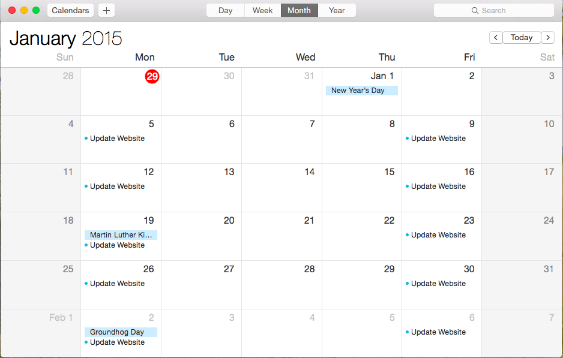

## 9. Testing and Maintenance Reflection

Include images of your maintenance schedule (inline, using markdown) below:

Schedule:

-Mondays: Update my site with any new info given by dbc. ie. New blog entries
-Fridays: Make sure all updates are complete.

***
1. While testing, did you find any errors in your code? How did you handle them?

ANSWER: I went ahead with the w3schools validating website. It looks like I passed with flying colors. It found no errors at all. That felt really good. I feel like my site is very simple at first glance; However, I can honestly say I worked very hard on it to make it look how it does.

2. Did you receive any particularly helpful feedback? Why was it helpful?

ANSWER: Since there were no errors, all I got was a link to the validation page

3. How do you plan to incorporate the feedback you received?

ANSWER: I guess I'll keep up with what it is I'm doing. Keep up with maintaining my site on a regular schedule.
