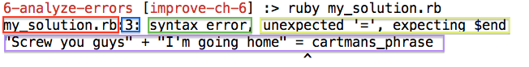

[Week 3 Home](../)

# U1.W3: Analyze Errors

## Learning Competencies
- Run Ruby programs from the command line
- Analyze error messages to determine why they are happening

## Summary
You have probably already had your share of seeing error messages pop up in your console, which can be very frustrating. If you've taken a look at the error messages that get returned, it can be difficult to get past the "gobbledygook" to find out what the problem is. In this challenge, you will be encountering errors. The point is to learn how to read each error. If you want to fix it, you can do that as well, the main intent is to learn how to read errors.

## Releases

## Release 0: Run your [my_solution.rb](my_solution.rb) in the console using the Ruby interpreter like this:

`ruby my_solution.rb`

You should see something like this:

`my_solution.rb:20: ...`

## Release 1: Encounter the Error

Read the error closely. You will have questions to answer for each error. To get an understanding of how to read these messages, The first message is analyzed here.



Answer the following questions for each error in your [my_solution.rb](my_solution.rb) file as a comment.

#### 1. What is the name of the file with the error?
(You will only need to answer this once.)
  *The filename is the first part of the error message, boxed in red.*

   **Answer:** The error is occurring in the `my_solution.rb` file.

#### 2. What is the line number where the error occurs?
  *The line number is always immediately after the file name, and is boxed in blue.*

  **Answer:** The error occurs on line 3.

#### 3. What is the type of error message?
  *The type of error is directly after the line number, and is boxed in green.*

  **Answer:** This is a [syntax error](http://www.ruby-doc.org/core-2.1.5/SyntaxError.html).

#### 4. What additional information does the interpreter provide about this type of error?
  *After the type of error, it will tell you what the issue was, in this error, it's boxed in yellow.*

  **Answer:** The interpreter says it did not expect an "=" sign, rather it expected an $end.

#### 5. Where is the error highlighted in the code?
  *The interpreter puts an arrow at the location the error occurs, in purple.*

  **Answer:** The interpreter did not expect an equals sign between "I'm going home" and cartmans_phrase.

#### 6. Why did the interpreter give you this error?
  *You will need to use your knowledge of Ruby to figure this out, along with the error message.*

  **Answer:** Ruby does not allow variable assignment this way. Variables have to be the first thing identified, and operations occur after the equals sign. This error would not occur if the code was:

  ```ruby
    cartmans_phrase = "Screw you guys " + "I'm going home."
  ```

## Release 1: Comment the error
When you finish answering the questions, comment out the code with the error and run the file again. You can choose to fix the error if you desire.

## Release 2: Repeat
Repeat release 0 and 1 for each error until there are no errors left to assess!

## Release 3: Reflect
Once you've assessed all of the errors, write a reflection (keep it to 10-15 min) in the [my_solution.rb](my_solution.rb) file.

## Additional Resources
Check out these links to better understand how errors work in Ruby and how you can "catch" them instead of letting them crash your program.

- [http://www.skorks.com/2009/09/ruby-exceptions-and-exception-handling/](SKORKS: Ruby Exceptions And Exception Handling)
- [http://rubylearning.com/satishtalim/ruby_exceptions.html](Rubylearning: Ruby Exceptions)
- [http://www.tutorialspoint.com/ruby/ruby_exceptions.htm](Tutorialspoint: Ruby Exceptions)
- *The Well-Grounded Rubyist* by David A. Black ch. 6.4 (Check out the [bonus challenge](10-BONUS-challenges/Well-Grounded-Rubyist.md) before you buy the book!)
